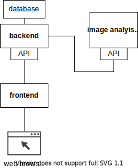

# ARIAVT documentation

## Application architecture

**Microservices architecture** with RESTful APIs.

Services:
  * Backend (+ database)
  * Frontend
  * Image analysis service (Deep Learning service)

### Diagram

## Frameworks and libraries

  * Backend
    - [FastAPI](https://fastapi.tiangolo.com/)
    - Database: [PostgreSQL](https://www.postgresql.org/)
  * Frontend
    - [React](https://reactjs.org/)
  * Image analysis service
    - [FastAPI](https://fastapi.tiangolo.com/)
    - [PyTorch](https://pytorch.org/)

